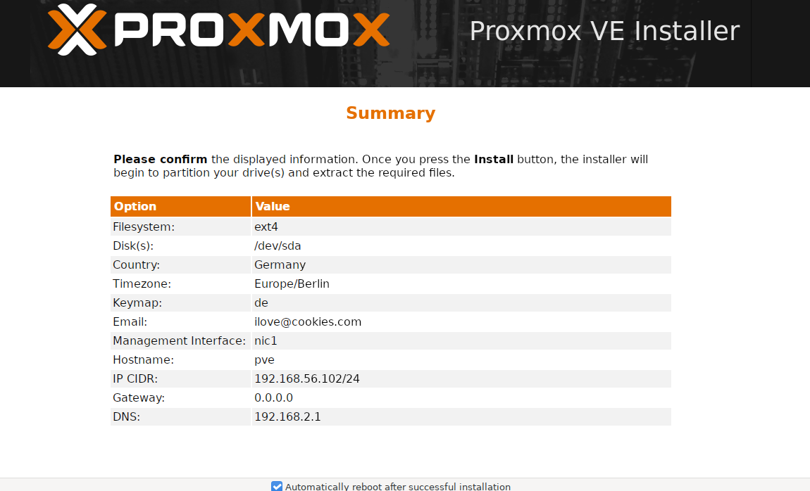

# Einrichtung Proxmox VE 9.1 fürs lokale Testen

Installiert und konfiguriert eine Proxmox 9.1 Instanz mit graphischer Web-Oberfläche

## Vorraussetzung

- Heruntergeladene Proxmox VE 9.1 ISO [Link](https://www.proxmox.com/en/downloads/proxmox-virtual-environment/iso)
- Ordner in der sich die ISO befindet. Hier unter `D:/isos`
    - Der Ordner wird auch für zukünftige ISOs dienen
- VirtualBox Installation [Link](https://www.virtualbox.org/wiki/Downloads)
- Idealerweise angeschaltener VT-d Support bei Intel Plattformen/AMD hat sowas ähnliches

## VirtualBox Setup

- Auf Schaltfläche `NEU` klicken
- VM benennen wie gewünscht
- Ordner auswählen; Hier `D:/vms`
- ISO Auswählen
- Betriebssystem kann vorausgewählt werden
    - Linux
    - Debian
    - Debian (64-bit)
- Ich würde hier keine unbeaufsichtigte Installation empfehlen, macht das initiale konfigurieren des primären Netzwerkadapters einfacher
- Hardware-Ressourcen festlegen
    - Zum Testen sollten ausreichen
        - 4 CPU
        - 4 GB Ram
        - <= 20 GB HDD
    - Kann später ggf angehoben werden
- Mit `Fertigstellen` erst einmal bestätigen. **Noch nicht VM starten**
- Rechtsklick auf die neue VM und `Ändern` auswählen
- Im neuen Fenster `Netzwerk` auswählen
    - Adapter 1 (Ist für Internetzugriff):
        - Aktiv
        - Angeschlossen an NAT
        - Virtuelles Kabel verbunden
        - Keine Port-Weiterleitungen
    - Adapter 2 (Für Zugriff von Host -> Proxmox)
        - Aktiv
        - Angeschlossen an Host-Only Adapter
        - Promiscous-Mode aus
        - Kabel verbunden
- Im neuen Fenster `Gemeinsame Ordner` auswählen
    - Neuen Gemeinsamen Ordner anlegen
        - Name egal; Hier `isos`
        - Ordnerpfad = ISOs Pfad von oben; Hier `D:/isos`
        - Einbindepunkt/Mount-Point: /mnt/shared
        - Nur lesbar
        - Automatisch einbinden
- VM Starten
- In der graphischen Übersicht des Installers den 1. Punkt `Install Proxmox VE (Graphical)` auswählen
- EULA akzeptieren
- Bei der HDD-Auswahl einfach auf `Next` klicken
- Locale ggf. auf bspw. Deutschland/Germany stellen
- Admin (Root)-Passwort vergeben
- **Achtung!** Hier muss eine valid aussehende Email eingetragen werden, die nicht der Default ist
- Netzwerk-Config:
    - Im Dropdown nic1 auswählen (Host-Only-Adapter)
    - Hostname egal
    - IP-Adresse sollte etwa so aussehen `192.168.56.x`
        - Default VirtualBox-Netz
        - Sollte logischerweise 192.168.56.2 oder größer sein
        - CIDR kann auf 24 stehen bleiben
        - Gateway auf `0.0.0.0` stellen (Später dazu mehr)
        - DNS Server auf Default stehen lassen oder sowas wie `8.8.8.8` (Google), `1.1.1.1` (Cloudfare), etc. eintragen
- Im Summary Eintragungen überprüfen
    - Könnte wie folgt aussehen 
- Auf `Install` klicken und die Installation durchführen lassen
- Wenn die Maschine rebootet und wieder im Proxmox Install Screen landet unter `Geräte -> Optische Laufwerke -> Entfernt das virtuelle Medium aus dem Laufwerk` auswählen
- VM ausschalten/herunterfahren und dann über VirtualBox wieder starten lassen
- Im GRUB Screen `Proxmox VE GNU/Linux` auswählen und booten lassen
- Nach dem Hochfahren sollte ein Screen mit dem Text `Welcome to the Proxmox Virtual Environment. ...` stehen und darunter eine https-Addresse
    - Diese Addresse auf der Hostmaschine in einem Browser aufrufen
    - Aufruf sollte erfolgreich sein und die Web-Maske öffnen
- Login-Daten sind Nutzername `root` und das Passwort welches im Einrichtungsschritt vergeben wurde

## Proxmox-Konfiguration